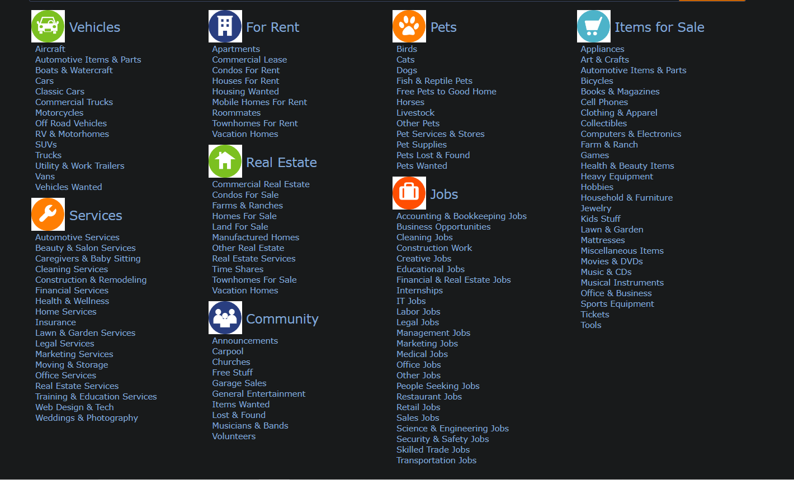
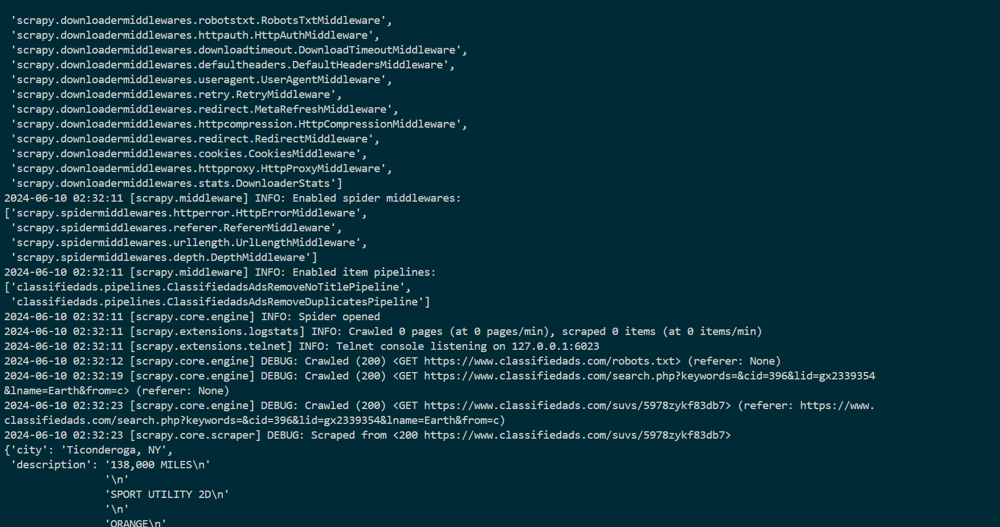
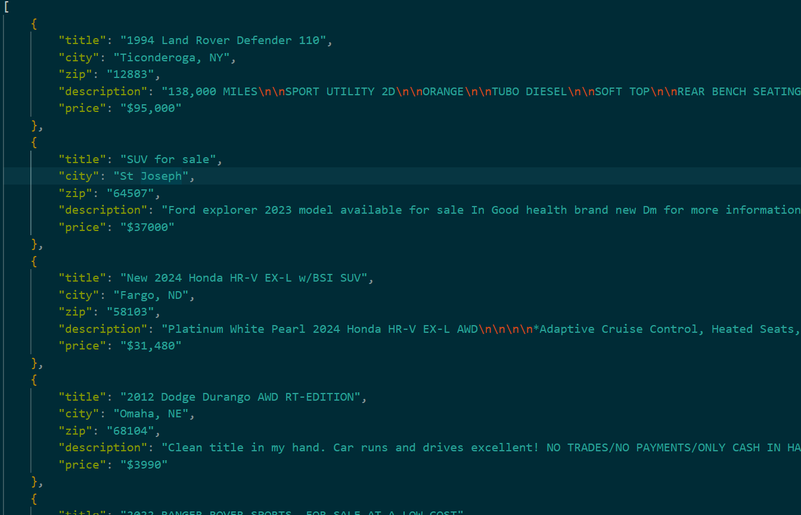

# Classified Ads Scraper
Scrape ads from [ClassifiedAds.com](https://www.classifiedads.com/)

## Requirements
- Python (>= 3.10)

## Reproducing the environment
- Clone the repository.
    ```bash
    git clone https://github.com/toludaree/classified-ads-scraper.git
    ```
- Create a python virtual environment and activate it. You can use the `venv` package. Name the environment `.venv`.
    ```bash
    python -m venv .venv

    # Activate
    .venv/Scripts/activate     # Windows
    source .venv/bin/activate  # Linux
    ```
- Install `scrapy` and other associated libraries through `requirements.txt`
    ```bash
    pip install -r requirements.txt
    ```

## Scrape ClassifiedAds
- Navigate into the `classifiedads` directory.
    ```bash
    cd classifiedads
    ```
- Choose the category or subcategory you want to scrape from [ClassifiedAds.com](https://www.classifiedads.com/). Here is a screenshot of all the categories and subcategories
    
- Begin the scrapy process using the `scrapy crawl` command.
    ```bash
    scrapy crawl ads -a name=<category> -O <file-path>

    # category - name of subcategory that you chose from the last section
    # file-path - path to save the results of the scraping process too. It can be a JSON, CSV or an XML file.
    ```
    - For example, we might want to scrape SUV ads and save the file to `suv.json`.
        ```bash
        scrapy crawl ads -a name="SUVs" -O suv.json
        ```
    - A screenshot of the crawling session in progress
        
    - A screenshot of the results. You can get the JSON file [here](docs/suv.json)
        
